Title: Docker Three Tier Architecture 
---

# Three-Tier Application Deployment using Dockerfile

## Prerequisites

Before you begin, ensure that you have the following installed:

- [Docker](https://www.docker.com/get-started)
  
## Project Structure

Node.js application follows a three-tier architecture:
Database Tier:
-  Utilizing MongoDB for data storage and management.
- Frontend and Backend Tier: HTML and CSS for frontend and Node.js is used for backend development.
-  Management Server: mongo-express serves as a web-based interface for managing the MongoDB database.

## STEP BY STEP PROCESS
Create any three-tier application using Docker, using a multi-container setup. Build at least one docker image using Dockerfile. You are free to use your old projects, build new projects or take any project from GitHub. However, if you are using a project from Github, properly cite the original author of the code in your blog. 

Step 1: Clone the Project
To begin, clone the project from the repository hosted by Nana Janashia. You can access the project via the following Git URL:
https://gitlab.com/nanuchi/developing-with-docker.git
Once cloned, navigate to the directory where the project has been downloaded.
Open a terminal window and change the directory to the one where the project was cloned.

Step 2: Create a Docker Network
Create a Docker network to ensure container isolation. This will help in managing communication between containers.

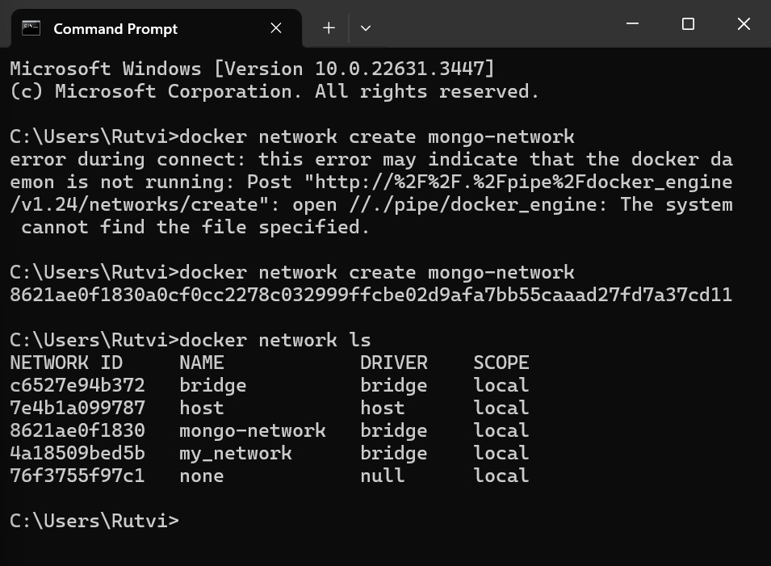

## Dockerfile(Backend)
Step 4: Run the Database Container
Run the MongoDB container with the following command:

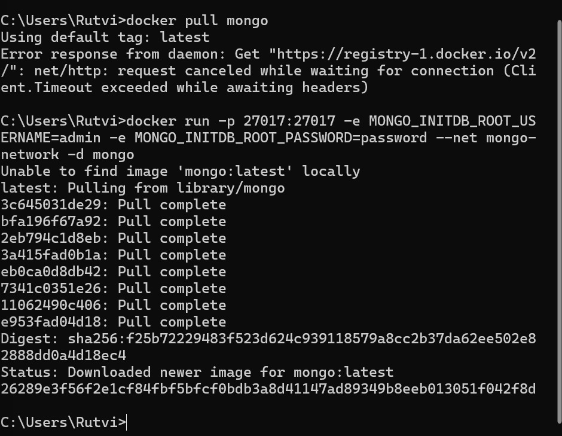
## Dockerfile(Frontend)
Creates a detached MongoDB container named "mongodb_server".
Connects it to a specified Docker network.
Maps host port 27017 to container port 27017 for MongoDB client connections.

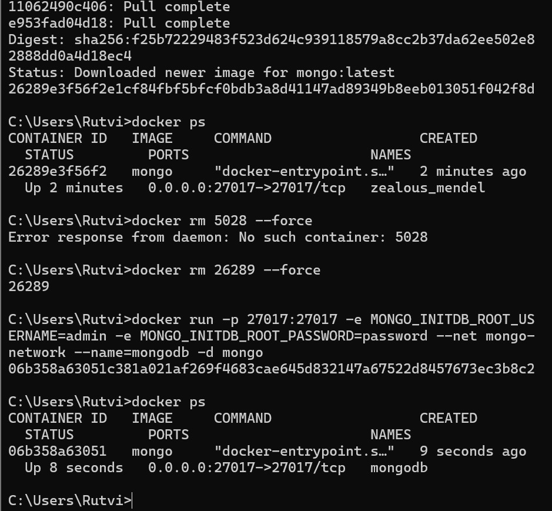
## Deployment Steps
0. Create Network
   - Navigate to the project directory
   - bash
     docker network create my-network
     
     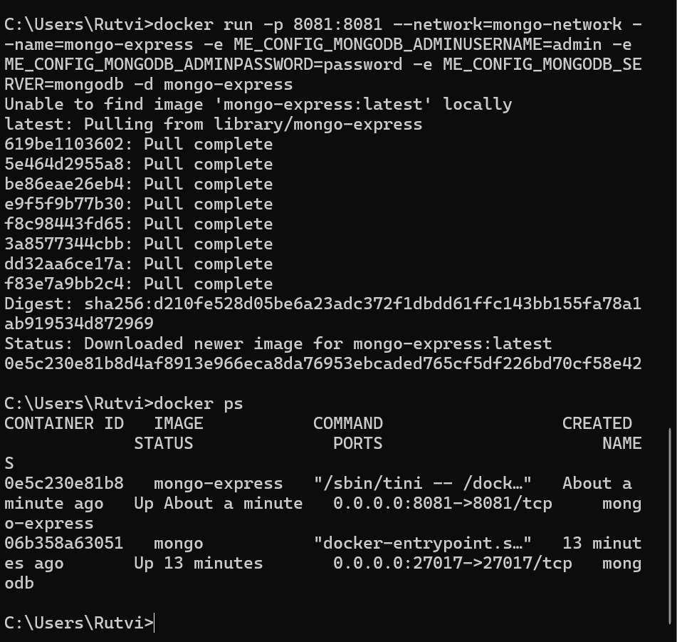
1. MySQL Database:

   - Navigate to the mysql directory.
   - Build the MySQL Docker image:
     bash
     docker build -t mysql-image .
     
     
     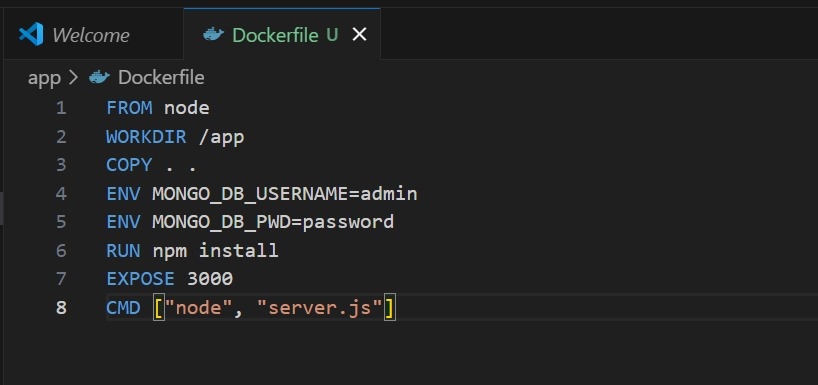
     
   - Run the MySQL container:
     bash
     docker run --name mysql-container --network=three-tier-network -p 3306:3306 -v mysql-data:/var/lib/mysql -d mysql-image
     
     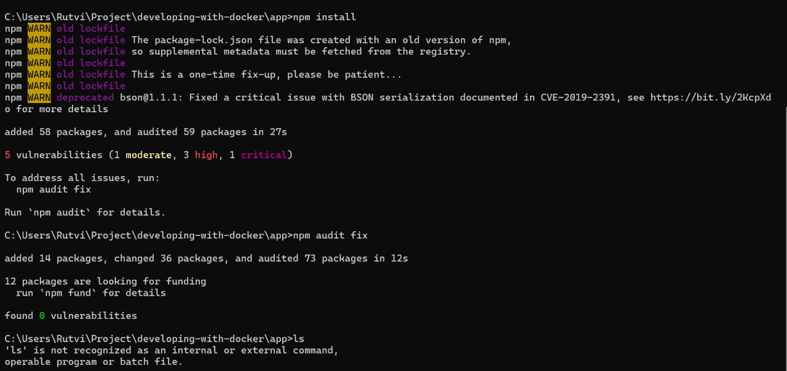
   - Access the MySQL container:
     bash
     docker exec -it mysql-container /bin/bash
     
   - Inside the container, create tables for the database:
     sql
     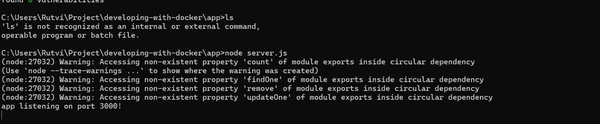
     USE school;
     CREATE TABLE student (id INT AUTO_INCREMENT PRIMARY KEY, name VARCHAR(40), roll_number INT, class VARCHAR(16));
     CREATE TABLE teacher (id INT AUTO_INCREMENT PRIMARY KEY, name VARCHAR(40), subject VARCHAR(40), class VARCHAR(16));
     
     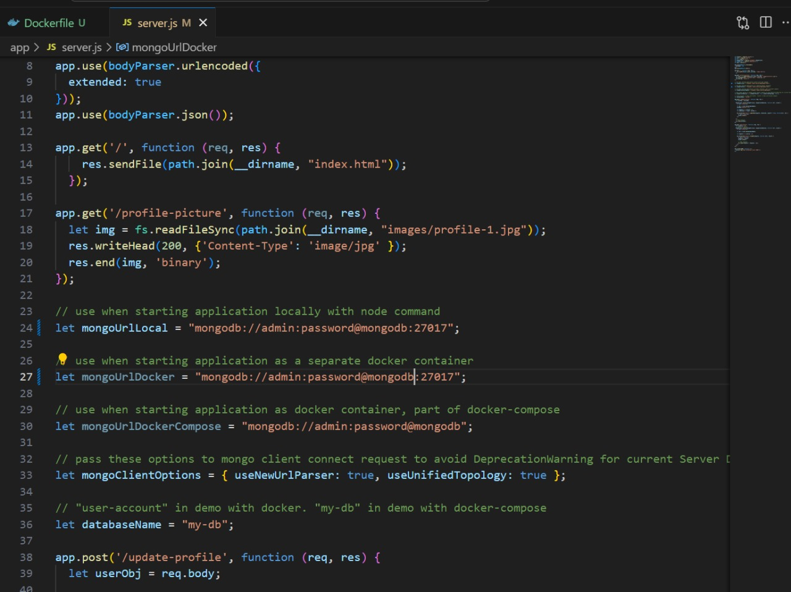
2. Backend Application:

   - Navigate to the backend directory.
   - Build the backend Docker image:
     bash
     docker build -t backend .
     
     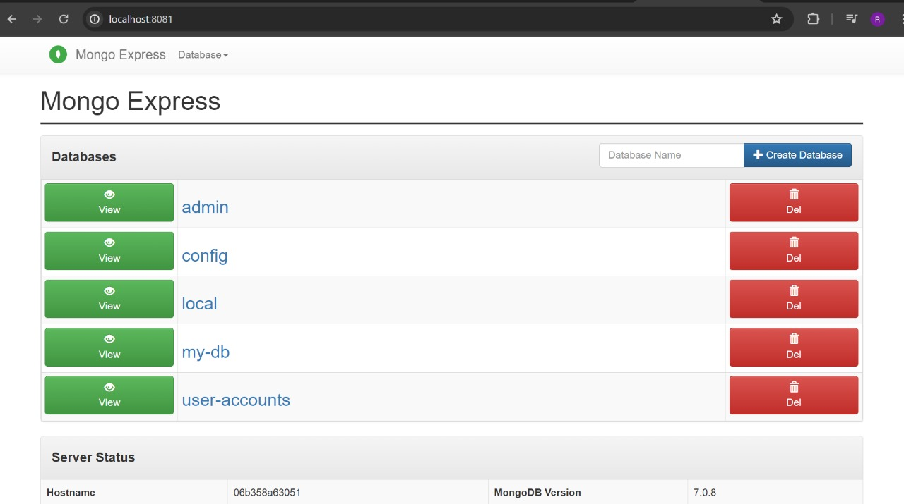
   - Run the backend container:
     bash
     docker run -d -p 3500:3500 --name backend-container --network=three-tier-network backend
  
3. Frontend Application:

   - Navigate to the frontend directory.
   - Build the frontend Docker image:
     bash
     docker build -t frontend .
     
     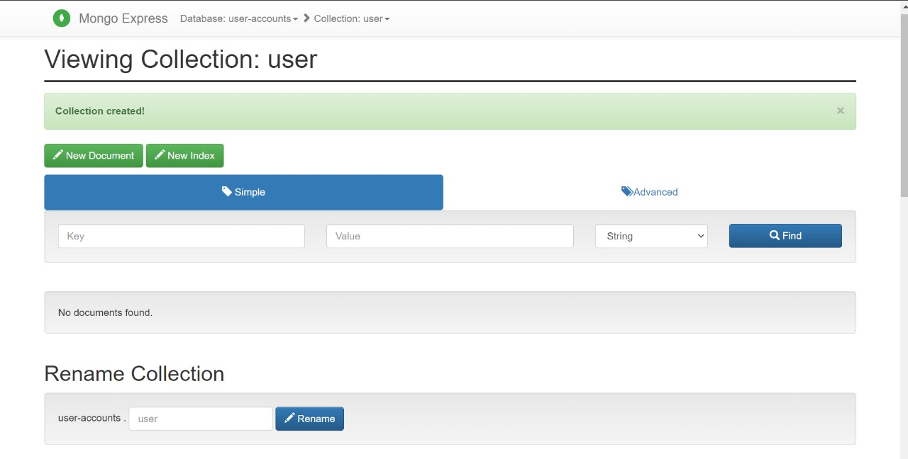
   - Run the frontend container:
     bash
     docker run -d --name frontend-container --network=three-tier-network -p 80:80 frontend
     
     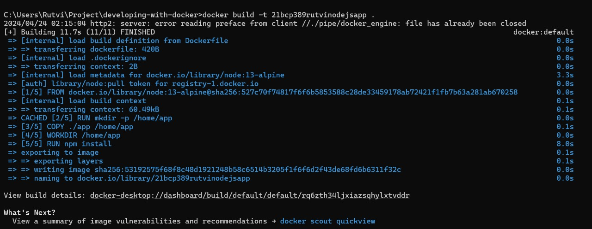
4. Access the Application:

   Open your favorite browser and visit [http://localhost:80](http://localhost:80). Enjoy exploring the MERN stack application!
   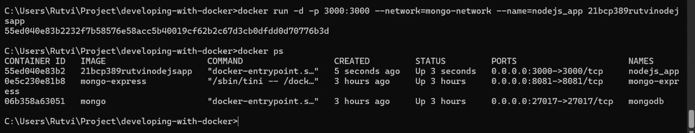
   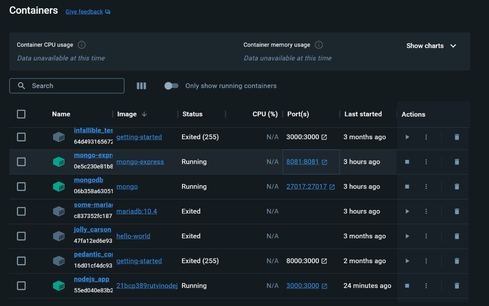
  

    
## Data Persistence

Data persistence is ensured by using Docker volumes. If the MySQL container is deleted, data remains available and is automatically added to a new Docker container by providing the same Docker volume.

Feel free to explore and modify the Dockerfiles to enhance your understanding of containerization and deployment! Happy coding! 🚀